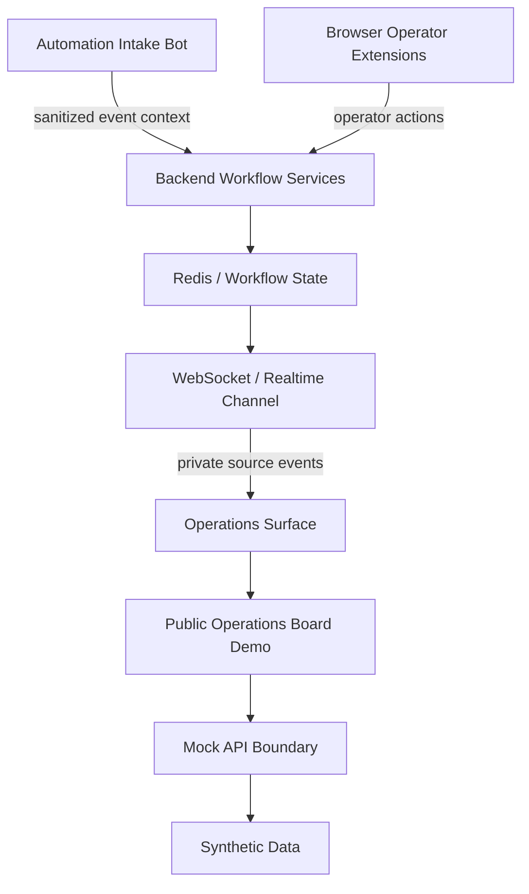
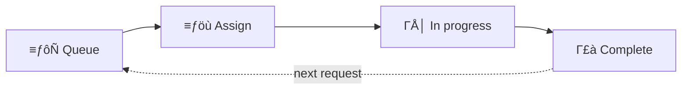
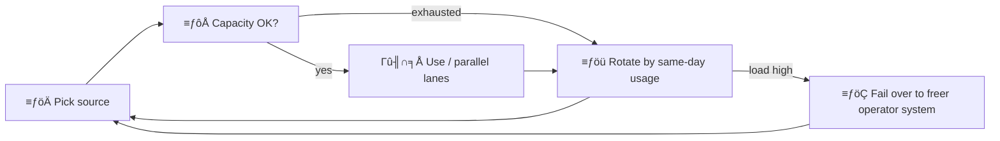
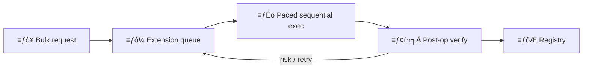
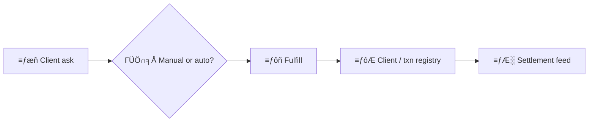
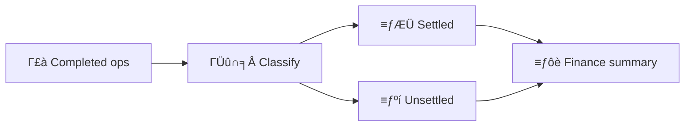
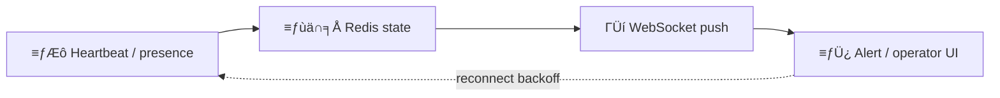

# Operations Board ΓÇö Public Architecture Showcase

Anonymized React case study extracted from a private SaaS operations workflow.
Product-specific language, live APIs, and real auth were removed. What remains is
a focused board demo with modular frontend architecture, typed contracts, and CI
gates.

## Live demo

Desktop-focused static site (mock API only ΓÇö no secrets, no server).

**Live demo:** https://operations-board-react-showcase.vercel.app

Source: https://github.com/aliniroomand34/operations-board-react-showcase

Architecture FAQ: [docs/INTERVIEW_DEFENSE.md](docs/INTERVIEW_DEFENSE.md) ┬╖
Demo script (~60s): [docs/RECRUITER_DEMO_SCRIPT.md](docs/RECRUITER_DEMO_SCRIPT.md)

## Problem

Private operations systems often mix strong frontend craft (boards, workflows,
domain rules) with sensitive product language and real backends. That mix is hard
to show in a public portfolio without leaking business detail.

This repo answers: **can architecture ownership on a real-shaped board workflow
be demonstrated safely ΓÇö while still explaining the larger system that board
belonged to?**

## System Context

The private source system was larger than a single board. At a category level it
included:

- **Automation intake** ΓÇö bots / automated channels that brought work into the
  workflow without operators typing every request by hand
- **Browser-based operator extensions** ΓÇö tools that reduced friction for
  operators and connected their actions into the same workflow
- **Backend workflow services** ΓÇö orchestration for validation, state transitions,
  auditability, and integration boundaries
- **Redis-backed transient state / queue coordination** ΓÇö short-lived workflow
  state, locks, rate limiting, or queue-like coordination in production
- **WebSocket / realtime channel** ΓÇö live operational updates to surfaces that
  operators watched
- **Operations board (frontend)** ΓÇö the human-facing projection for queue, assign,
  in-progress, and completion

This repository shows only a **safe frontend projection** of that board.
Private integrations are replaced by a mock API and synthetic transitions. The
demo does **not** run Redis, WebSockets, bots, or extensions ΓÇö it documents that
production architecture context and implements the anonymized board slice.

### Private system scale signals (context only)

| Capability | What it meant in production |
| --- | --- |
| Settlement & finance summaries | Settled vs unsettled work and related financial-ops summaries for operators |
| Resource pool Γëñ30 sources | Unnamed inventory sources; per-source daily capacity; usage-aware rotation; parallel lanes; load-based failover |
| Bulk intake → extension queue | High-volume requests composed across the pool, executed sequentially by a browser extension with paced delays, rate limits, retry/backoff |
| Client fulfillment | Client-requested fulfillment via manual operator steps or automated handoffs |
| Clients & transactions registry | Persistent client records and transaction history for auditability |
| Post-operation verification | Extension re-check after client completion before trusting the outcome |
| Realtime alerts & errors | WebSocket push of live warnings / failures to operator surfaces |
| Team concurrency & roles | ~20 concurrent primary operators, ~50 concurrent clients, owner-level operators, plus audit/oversight |
| Live presence / connection health | Realtime online status for inventory sources and operator extensions |
| Ops resilience patterns | Bounded queues / backpressure, idempotent transitions, reconnect backoff, Redis-backed locks or rate coordination |

**Capacity snapshot (private context):** Γëñ30 inventory sources ┬╖ ~20 concurrent
operators ┬╖ ~50 concurrent clients ┬╖ WebSocket alerts + presence



### Workflow cycles (graphs)

Same cycles appear as interactive-style graphs on the Home landing. Below is the
README / GitHub-rendered form. Only the **board lifecycle** is implemented in
this demo; the others are private-system context.

#### 1) Board lifecycle ΓÇö **in this demo**



#### 2) Resource pool cycle ΓÇö context only



#### 3) Bulk → extension queue — context only



#### 4) Client fulfillment ΓÇö context only



#### 5) Settlement cycle ΓÇö context only



#### 6) Realtime presence & alerts ΓÇö context only



## Scope

**In scope**

- Desktop-focused Operations Board demo (`/operations`)
- Public routes only: `/`, `/operations`, `*`
- UI / Logic / API / helpers separation
- Drag/drop assignment plus keyboard-friendly **Assign batches** path
- In-memory mock API + synthetic data (`client-001`, `batch-001`, …)
- Visible loading / error / empty states with recovery actions
- TypeScript on the public demo surface
- Vitest + RTL tests on the showcase slice
- GitHub Actions CI + Vercel / Netlify static deploy configs
- Short ADRs and resume-aligned wording
- Documented private workflow context (categories only)

**Out of scope**

- Private admin surfaces, operator tooling outside this board, and other private SaaS screens
- Real backends, tokens, production domains, or auth claims
- Live Redis, WebSocket servers, automation bots, or browser extensions in this repo
- Production-grade responsive design (desktop-first)
- Full WCAG certification (semantic HTML + keyboard basics only)

Privacy boundary checklist: [docs/PUBLIC_SURFACE.md](docs/PUBLIC_SURFACE.md)

## Architecture

### Private source system context

In the private product, the board was one surface among several. Automation intake
and operator extensions fed backend workflow services; those services coordinated
transient state (including Redis-backed patterns) and pushed updates over a
realtime channel. Operators used the board to see queued work, assign inventory
batches, track in-progress operations, and record completion.

That context explains **why** the public board has queue → assign → in-progress →
complete semantics. It is not implemented here as live infrastructure.

### Public demo implementation

What this repository actually ships:

```
App shell → public routes → OperationsBoardPage
  → useOperationsBoardLogic (orchestration)
  → OperationsBoardColumns + Modals (UI)
  → operationsBoard.helpers (pure domain rules)
  → operationsBoard.api (mock boundary)
  → mocks/operationsBoard.data (synthetic seed)
```

| Layer | Responsibility |
| --- | --- |
| Page / columns / modals | Presentation, interaction, a11y labels |
| `useOperationsBoardLogic` | Orchestration: load board, open modals, call API |
| `operationsBoard.helpers` | Pure rules (validation, capacity, drop ids) |
| `operationsBoard.api` | Async boundary (delay, failure, transitions) |
| `operationsBoard.types` | Domain contract shared across layers |

Domain language is public: operation request, client, inventory batch. Drag a ready
batch onto a queued client, confirm assignment, then complete the in-progress
operation ΓÇö or use the keyboard assign path for the same outcome.

Decision records:

- [001 ΓÇö Extract portfolio slice](docs/adr/001-extract-portfolio-slice.md)
- [002 ΓÇö Mock API boundary](docs/adr/002-mock-api-boundary.md)
- [003 ΓÇö TypeScript migration strategy](docs/adr/003-typescript-migration-strategy.md)
- [004 ΓÇö Testing strategy](docs/adr/004-testing-strategy.md)
- [005 ΓÇö Showcase deps & typed surface hygiene](docs/adr/005-showcase-deps-and-typed-surface.md)

Resume bullets: [docs/RESUME_BULLETS.md](docs/RESUME_BULLETS.md)

## Technology Context

| Concern | Private source system (context) | This public demo |
| --- | --- | --- |
| Redis | Transient workflow state, rate limiting, locks, or queue-like coordination | Documented only |
| WebSocket / realtime | Live operational updates to operator surfaces | Mock API delays and confirmed transitions |
| Backend orchestration | Validation, state transitions, auditability, integration boundary | Simulated inside `operationsBoard.api` + pure helpers |
| Automation intake | Brought work into the workflow without manual entry for every case | Synthetic queued requests in seed data |
| Operator extensions | Reduced operator friction; connected actions into the workflow | Out of scope; board actions stand in for the human path |
| Capacity / team scale | Γëñ30 inventory sources, ~20 operators / ~50 clients, settlement, presence | Documented on Home + README ΓÇö not live RBAC / pool UI |
| Frontend board | Typed domain contracts, operator workflows, accessible modals, DnD + keyboard | **Implemented** ΓÇö the showcase slice |

## Demo Walkthrough

A short path a reviewer can follow in ~60 seconds. Spoken lines:
[docs/RECRUITER_DEMO_SCRIPT.md](docs/RECRUITER_DEMO_SCRIPT.md).

1. **Home** ΓÇö system-context cards, **workflow cycle graphs**, and scale signals
   (only the board lifecycle graph is live in the demo; the rest are context)
2. **Queue** ΓÇö operation requests as queued work
3. **Ready batches** ΓÇö inventory batches ready to assign
4. **Assign** ΓÇö drag a ready batch onto a queued client, or use **Assign batches**
5. **In progress** ΓÇö the operation moves to the in-progress column
6. **Complete** ΓÇö record completion from the board controls
7. **Recovery** ΓÇö demo controls for loading, error + retry, and empty states

Optional: assign more capacity to an in-progress request, or cancel a queued
request, to show secondary workflow paths.

## What this proves

| Proves | Does not prove |
| --- | --- |
| Frontend state orchestration for an operations board | Live Redis / WebSocket engineering in this repo |
| Domain rule extraction into pure, testable helpers | Ownership of the full private backend |
| Typed contracts across UI, hook, API, and mocks | Exhaustive TypeScript mastery across every codebase |
| Mock API boundary suitable for static deploy | Production API or auth design |
| Accessibility basics (semantics, modal focus, status regions) | Full WCAG certification |
| Behavior-focused Vitest + RTL coverage | Exhaustive E2E / DnD pointer coverage |
| Safe anonymization for a public portfolio | That the demo is the entire private product |

## Tradeoffs

| Choice | Why | Cost |
| --- | --- | --- |
| Showcase one board, not the full product | Clear reviewer signal + safer public surface | Broader private surfaces stay category-only in docs |
| Document bot / extensions / Redis / realtime as context | Shows the boardΓÇÖs place in a real workflow system | Reviewers must read ΓÇ£contextΓÇ¥ vs ΓÇ£implementedΓÇ¥ carefully |
| Mock API instead of real HTTP | Zero secrets; static deploy; demoable async states | Not a live backend / realtime story |
| TypeScript + CI on the public demo | Refactor safety on the surface reviewers browse | Incremental migration, not a greenfield TS rewrite of a full product |
| Test helpers + modal assign, not DnD pointers | Stable, behavior-focused tests | Drag choreography is manual demo only |
| Desktop-first polish | Matches the real private product posture | No responsive portfolio claim |

## Testing strategy

- **Unit** ΓÇö domain helpers and mock API status transitions
- **RTL** ΓÇö loading, error + retry, empty, assign / assign-more, cancel queued,
  complete, modal Escape/close/focus restore, route shell, ErrorBoundary
- **Intentionally skipped** ΓÇö CSS layout, pointer physics for drag/drop

```bash
npm run test
```

See [ADR 004](docs/adr/004-testing-strategy.md) for what is and is not tested.

## Privacy / anonymization

- Synthetic ids and amounts only
- No real client PII, private endpoints, or production credentials
- Domain language uses public terms only (operation request, client, inventory batch)
- Larger system pieces are described by **category** ΓÇö never by private product names

## Engineering notes

Architecture boundaries, naming, and scope cuts are intentional decisions owned in
review. AI tools may accelerate drafting; tradeoffs remain interview-defendable by
the author.

## Next improvements

- Shorter orchestration hook and clearer transition helpers
- Thin real HTTP adapter behind the same API boundary (optional for a static demo)
- Keep the live deploy aligned with `main` after merges

## Stack

- React 19 + Vite
- TypeScript (strict) on the public demo
- React Router
- Tailwind CSS
- `@dnd-kit` for board drag/drop
- Vitest + React Testing Library

## Run locally

```bash
cd frontend
npm install
npm run dev
```

No `.env` or API URL is required. The Operations Board loads from
`src/mocks/operationsBoard.data.ts` via `operationsBoard.api.ts`.

```bash
npm run typecheck
npm run lint
npm run test
npm run build
npm run preview
npm run ci
```

## Deploy (free tier)

Static hosting only ΓÇö the mock API runs in the browser.

### Vercel

1. Import this repository in [Vercel](https://vercel.com).
2. If the Git root is this package: `vercel.json` builds with `npm run build` and
   publishes `dist`. If the Git root is a monorepo parent: use the parent
   `vercel.json` that points at `frontend`.
3. Deploy. No environment variables are required.

### Netlify

1. Import this repository in [Netlify](https://www.netlify.com).
2. If the Git root is this package: `netlify.toml` runs `npm run build` and publishes `dist`.
   If the Git root is a monorepo parent: use the parent `netlify.toml` with `base = frontend`.
3. Deploy. No environment variables are required.

SPA routes (`/operations`, unknown paths) are rewritten to `index.html` in both configs.

## CI

GitHub Actions runs on push/PR (same gates as `npm run ci`):

- Package-as-repo-root: [`.github/workflows/ci.yml`](.github/workflows/ci.yml)
- Monorepo parent (workspace copy): [`.github/workflows/ci.yml`](../.github/workflows/ci.yml)

1. `npm ci`
2. `npm run typecheck`
3. `npm run lint`
4. `npm run test`
5. `npm run build`

## Accessibility (demo basics)

- Skip link to main content
- Semantic headings, buttons, and column regions
- Loading / error / empty states with `role="status"` / `role="alert"`
- Modals: `aria-modal`, labelled title, Escape to close, restore focus
- Visible `:focus-visible` outlines
- Scope: desktop demo polish, not a full accessibility certification
